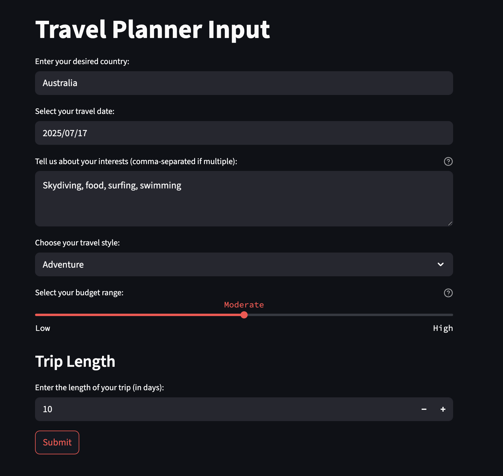
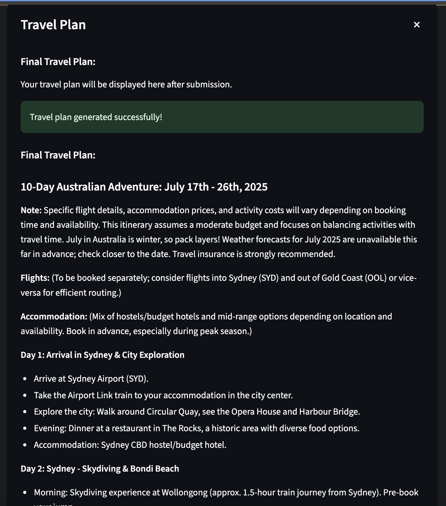
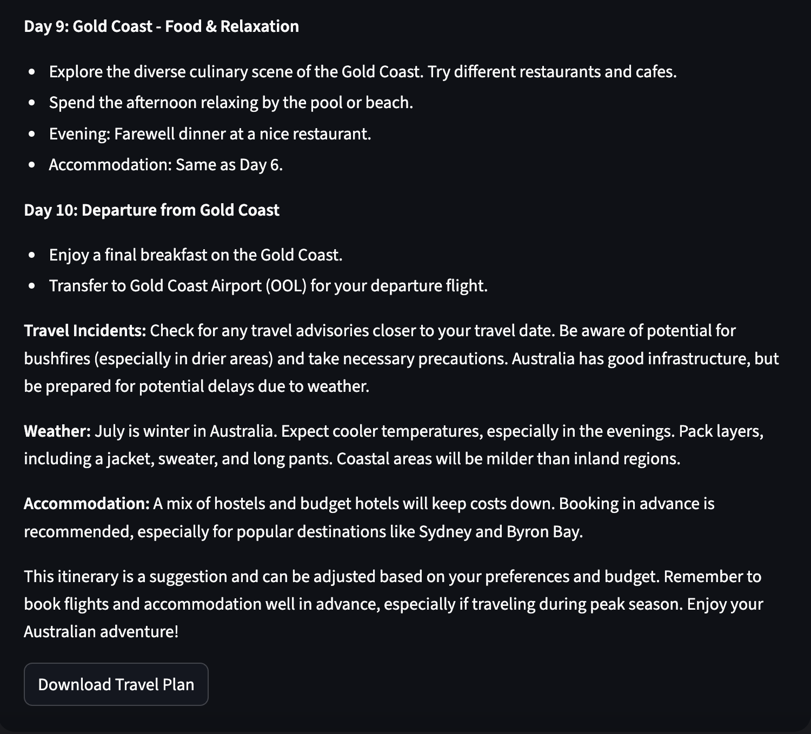

# Amazing Travel Planner

Amazing Travel Planner is an AI-powered application powered by **LangGraph**, **FastMCP**. It aims to help users plan personalized trips based on their interests, travel style, budget, and destination. It leverages advanced language models, real-time web search, and multiple travel-related tools to generate comprehensive travel itineraries.

## Features

- **Personalized Travel Plans:** Enter your country, travel date, interests, travel style, budget, and trip length to receive a detailed, day-by-day itinerary.
- **Real-Time Information:** Integrates web search for up-to-date recommendations on attractions, hotels, flights, weather, and travel incidents.
- **Interactive UI:** Built with Streamlit for a user-friendly experience.
- **Modular Architecture:** Uses LangChain, LangGraph, and MCP for flexible, extensible agent and tool orchestration.


## Architecture

- **LangGraph StateGraph**: Defines graph with branches for each agent.
- **FastMCP Server**: Hosts tools independently, letting LangGraph agents call them.
- **LLM Routing**: Uses messages (`SystemMessage`, `HumanMessage`) to invoke the correct tool.

## Project Structure

```markdown
amazing-travel-planner/
├── tools/                       # FastMCP tools server code
│   ├── Dockerfile               # Dockerfile for the server
│   └── server.py                # MCP server with all tool definitions
│
├── src/
│   ├── agents/                  # Agent logic modules
│   │   ├── tour_guide.py        # Tour Guide agent node
│   │   ├── travel_expert.py     # Travel Expert agent node
│   │   ├── travel_planner.py    # Planner agent node
│   │   ├── tools.py             # Agent tool loader and llm
│   │   └── __init__.py
│   │
│   ├── graphs/                  # LangGraph graph definitions & orchestration
│   │   ├── state.py             # TypedDict state definitions
│   │   ├── graph.py             # Graph building and compilation
│   │   ├── runner.py            # Grapher runner
│   │   └── __init__.py
│   │
│   ├── clients/                 # MCP clients, LangChain adapters
│   │   ├── client.py            # MCP connection and tool loading helpers 
│   │   └── __init__.py
│   │
│   ├── ui/                      # Frontend code (Streamlit or other)
│   │   ├── app.py               # Streamlit app entrypoint
│   │   └── components.py        # UI components/widgets
│   │
│   ├── utils/                   # Utility functions/helpers
│   │   ├── json_utils.py        # JSON pretty print, serializers, etc.
│   │   └── __init__.py
│   │
│   ├── Dockerfile              # Dockerfile for the app
│   └── __init__.py
│
├── tests/                       # Unit and integration tests
│   ├── test.py
│   └── __init__.py
│
├── run.sh                       # Run on local
├── requirements.txt             # Python dependencies
└── README.md
```


## Getting Started
### Prerequisites
- Python 3.13+
- Docker (for running tools server)
- Gemini API key (for LLM access)

### Setup Instructions
1. pip install -r requirements.txt
2. Set up your Gemini API key `.env` file:
   ```bash
   echo GEMINI_API_KEY=__your_api_key_here__ >.env
   ```
3. Start the FastMCP server:
   ```bash
    ./run-server.sh
   ```
4. Run the Streamlit app:
   ```bash
   streamlit run src/ui/app.py
   ```
5. Open your browser to `http://localhost:8501` to access the app.
   
## Usage


The sample input form allows you to enter your travel preferences, such as destination, travel dates, interests, travel style, budget, and trip length. The application will then generate a personalized itinerary based on your inputs.


The sample output for a trip to Japan is shown below. You can enter your own preferences and get a personalized itinerary.


You may use download button to save the itinerary as a txt file.



